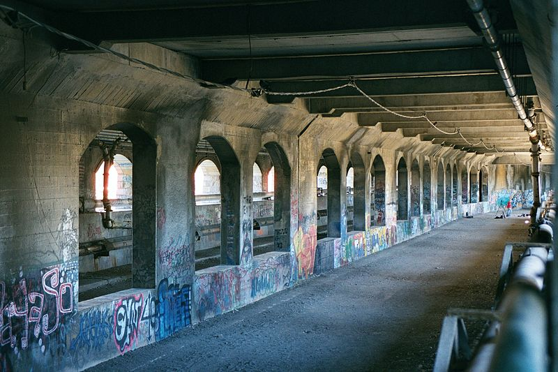

# IGME 480

# Current Topics in Interactive Development

### Spring 2025

# Fieldwork Guide: Conceptualizing Site-Specific Works Using Augmented Reality

## Overview
This fieldwork guide will help us explore and analyze real-world locations to develop site-specific AR/Locative Media projects. It focuses on observing spatial, cultural, and historical elements of sites in Rochester, NY and brainstorming creative ways to integrate AR into the chosen environment. You will draw from your fieldwork over the next couple of weeks and when you begin to brainstorm your final group projects.

## Objectives
- Develop an understanding of site-specificity in the context of AR and locative media.
- Analyze the spatial, cultural, and social aspects of a location.
- Generate initial concepts for AR experiences tailored to the site.

## Materials Needed
- Smartphone or tablet with a camera.
- Notebooks or sketchpads for notes and drawings.
- Map of the area.
- GPS app (optional, for spatial measurements).

## Preparation
1. Select a Location:
- Choose a site with cultural, historical, or social significance (e.g., a park, historic building, a bridge, etc).
- Consider accessibility, safety, and any permissions needed to use the space.
2. Research the Site:
- Investigate the history, purpose, and community associations with the site.
- Identify any existing narratives, symbols, historical figures or cultural practices linked to the location.
3. Define Your Focus:
- Decide if your project will emphasize storytelling, interaction, play, education, or artistic expression (this is optional, you can decide this later).

## Fieldwork Steps
### Step 1: Observation and Documentation
- Spend time exploring the site. Use all your senses to understand the space.
- Document the following:
    - Physical Characteristics: Shapes, colors, textures, and structures.
    - Soundscape: Ambient sounds, conversations, or music.
    - Light and Shadow: How light interacts with the environment during different times of the day.
    - Human Activity: How people interact with the space—patterns of movement, social behaviors, and use of the area.
- Capture photos, videos, and audio recordings to refer back to later.

### Step 2: Contextual Analysis
- Analyze the cultural and historical significance of the site.
- Reflect on questions like:
    - What stories or histories might be tied to this location?
    - What is the role of this site in the local community?
    - Are there overlooked or untold narratives or hidden information that AR could bring to light?

### Step 3: Brainstorming AR Concepts
- Begin generating ideas for your AR experience:
    - Begin by simply listing ideas, no matter how strange, non-sensical or dumb they may seem. Just list them, you can organize them into categories later.
    - Pick one or two and think about and discuss with your classmates how it can be turned into AR experience.
    - Some questions you may want to ask:
        - How can AR interact with the physical environment?
        - What digital elements (e.g., 3D models, soundscapes, animations) would enhance this space, landmark, etc?
        - How can your project prompt users to explore, reflect, or engage more deeply with the site?
- Sketch your ideas in your notebook or on-site photos, marking potential AR content placements.