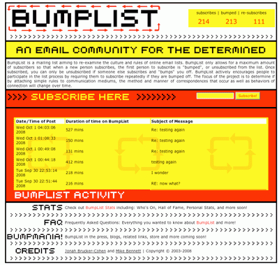

# Telematics & Network Art

This lecture borrows material from [Golan Levin](http://flong.com)

## Art Across Distances

**The impact of telecommunications technologies cannot be reduced to the practical and functional details of communication nor their economic impacts. They have meaning and implications far beyond the quick sending of messages and media to distant places. Psychologists and sociologists have discussed their impact on identity, privacy, interpersonal relationships, social movements, natonal boundiaries and more. Over the last four decades - especially since the advent of the World Wide Web - artists have explored the implications, possiblities and limits of these technologies. Artist and theorist [Roy Ascott](https://en.wikipedia.org/wiki/Roy_Ascott), who works with cybernetics and telematics - and is a pioneer in telecommunications-based art - believes that telecommunications technologies and the Internet are leading to an evolution of consciousness, while [Critical Art Ensemble](http://critical-art.net/) - a collective of [tactical media](https://en.wikipedia.org/wiki/Tactical_media) artists - believe this to be a kind of Western myopia borne of class-based privilege. We will look at both of these of artistic positions (and more) below.**

---

## Historical Telecommunication Machines

Smoke signals, reflected lights, homing pigeons are all early examples of human attempts to communicate across distances, what media theorist Marshall McLuhan would later refer to (in reference to telecommuications of the modern age) as "extending our central nervous systems".

*Semaphore towers, such as the [Chappe Telegraph](https://en.wikipedia.org/wiki/Chappe_telegraph) shown here, were "[optical telegraphs](https://en.wikipedia.org/wiki/Optical_telegraph)" a line of towers (usually 5 to 15 kilometers apart) used for sending coded messages and other textual information. These telegraphs were our first data networks*

*Telegraph Hill and Coit Tower, San Francisco*

*Hydraulic Telegraph, 4th century BC, Ancient Greece*

Today, we participate in synchronous video calls with Skype and FaceTime, collaboratively edit documents in Google Docs, and build multiperson virtual environments in MineCraft. These systems and processes are part of the fabric of everyday life, but it hasn't always been so, and it's worth stepping back and thinking about the use of networked telecommunications in media arts. As is often the case, some media artworks from the past presaged common tools today... and others represent intriguing dead-ends in the history of attempts to devise new modes of communication.

In the projects below, questions how each project resolves issues of:

* Critical consideration of the nature of networked communication
* One to many / many to one / many to many / one to one
* Operationalization of the participant (user-generated media)
* Asynchronous vs. synchronous communication
* Equal roles vs. complementary roles
* Inhabiting a shared virtual space
* Which senses are engaged
* Anonymity and intimacy

---

## Telematics & Telepresence

### Telephone Picture (László Moholy-Nagy, 1923)
The [first use of telecommunications as an artistic medium](https://en.wikipedia.org/wiki/Telematic_art) occurred in 1923 when the Hungarian constructivist artist László Moholy-Nagy made [Telephone Pictures](https://www.moma.org/collection/works/78747). These works questioned the idea of the isolated individual artist and the unique art object.

*"In April 1923, Moholy had Construction in Enamel 2 and 3 made at a local enamel factory. He would later claim to have ordered them by describing them over the telephone, exaggerating both his distance from the manufacturing process that produced them and the degree of technological mediation involved. In doing so Moholy presented the artist in the modern age as producer of ideas rather than things. While sharing the same abstract geometric composition, the works use a mathematical progression to change its scale, highlighting the conception of the image as transferable data."* (MoMA)

* Compare with Miranda July, [*Learning to Love you More*](http://www.learningtoloveyoumore.com/index.php). See #23, "[Recreate this Snapshot](http://www.learningtoloveyoumore.com/reports/23/23.php)"

### VideoPlace (~1972-1989)
Myron Krueger's landmark [VideoPlace](https://youtu.be/dmmxVA5xhuo) (~1972-1989) was a 2D artificial reality that enveloped its users, and responded to their movements and actions, without the use of encumbering goggles or gloves. One of the first interactive computer artworks, it allowed participants in different locations to share a common virtual space -- even, at different scales.

### Hole in Space (1980)
Hole in Space (1980) was a "communication sculpture" by Kit Galloway and Sherrie Rabinowitz, which used live two-way video to connect street-level audiences in Los Angeles and New York City.

*"On a November evening in 1980 the unsuspecting public walking past the Lincoln Center for the Performing Arts in New York City, and «The Broadway» department store located in the open air Shopping Center in Century City (Los Angeles), had a surprising counter with each other. Suddenly head-to-toe, life-sized, television images of the people on the opposite coast appeared. They could now see, hear, and speak with each other as if encountering each other on the same sidewalk. No signs, sponsor logos, or credits were posted--no explanation at all was offered. No self-view video monitors to distract from the phenomena of this life-size encounter. [...] «Hole-In-Space» suddenly severed the distance between both cities and created an outrageous pedestrian intersection. There was the evening of discovery, followed by the evening of intentional word-of-mouth rendezvous, followed by a mass migration of families and trans-continental loved ones, some of which had not seen each other for over twenty years."*

### Telematic Dreaming (1992-1993)
Paul Sermon's [*Telematic Dreaming*](https://www.hgb-leipzig.de/~sermon/dream/) (1992-1993) "is an installation that exists within the ISDN digital telephone network. Two separate interfaces are located in separate locations, these interfaces in themselves are dynamic installations that function as customized video-conferencing systems. A double bed is located within both locations, one in a blacked out space and the other in an illuminated space. The bed in the light location has a camera situated directly above it, sending a live video image of the bed, and a person ("A") lying on it, to a video projector located above the other bed in the blacked out location. The live video image is projected down on to the bed with another person ("B") on it. A second camera, next to the video projector, sends a live video image of the projection of person "A" with person "B" back to a series of monitors that surround the bed and person "A" in the illuminated location. The telepresent image functions like a mirror that reflects one person within another person's reflection." (Paul Sermon)

### R/Place (2017)
[*R/Place*](https://en.wikipedia.org/wiki/Place_(Reddit)) "was a collaborative project and social experiment hosted on the social networking site Reddit that began on April Fools' Day 2017. The experiment involved an online canvas of one million (1000x1000) pixel squares, located at a subreddit called /r/place, which registered users could edit by changing the color of a single pixel from a 16-colour palette. After each pixel was placed, a timer prevented the user from placing any pixels for a period of time varying from 5 to 20 minutes." (Wikipedia)

### ClearBoard (1990)
[*ClearBoard*](http://tangible.media.mit.edu/project/clearboard/), a work of HCI design research by Hiroshi Ishii and Minoru Kobayashi, "is designed to integrate interpersonal space and shared workspace seamlessly. A design goal of ClearBoard is to allow a pair of users to shift easily between interpersonal space and shared workspace using familiar everyday cues such as the partner's gestures, head movements, eye contact, and gaze direction. The key metaphor of ClearBoard design is 'talking through and drawing on a big transparent glass board.' ClearBoard requires less eye and head movement to switch focus between the drawing surface and the partner's face than is needed in either the whiteboard or the desktop environment. We found ClearBoard provides the capability we call "gaze awareness": the ability to monitor the direction of a partner's gaze and thus his or her focus of attention. A ClearBoard user can tell which screen objects the partner is gazing at during a conversation more easily and precisely than is possible in an ordinary meeting environment with a whiteboard." (MIT Tangible Media Group)

### The Trace (1995)
In [*The Trace*](http://www.lozano-hemmer.com/the_trace.php) (1995), an interactive installation by Rafael Lozano-Hemmer, a participant encounters the moving, ghostlike "presence" of another person, who is located in an identical but separate room. Their presence is conveyed by a glowing spot created by a pair of intersecting beams of light.

### Motion Phone (1995)
[*Motion Phone*](https://www.snibbe.com/motionphone-app/) by Scott Snibbe (1995; iOS version 2012) "is a new form of communication and a creative game. It lets people make abstract animations together over a network in a unique combination of conversation and creation. In MotionPhone's shared infinite canvas, people can create unlimited variations of movement by recording the gestures from their fingertips. When connected to other players, MotionPhone lets you create, comment, play, and communicate visually with others." (Scott Snibbe)

### Telegarden (1995)
Ken Goldberg & Joseph Santarromana's [*TeleGarden*](http://queue.ieor.berkeley.edu/~goldberg/garden/Ars/) is an art installation that allows web users to view and interact with a remote garden filled with living plants. Members can plant, water, and monitor the progress of seedlings via the tender movements of an industrial robot arm. Arguable the first "social network", The Telegarden was developed at the University of Southern California and went online in June 1995. In its first year, over 9000 members helped cultivate. In September 1996, the Telegarden was moved to the lobby of the Ars Electronica Center in Austria, where it remained online until August 2004.

### inTouch (1998)
[*inTouch*](https://tangible.media.mit.edu/project/intouch/) (Scott Brave & Andy Dahley, 1998) -- an experiment in telepresent haptics, allowed two people to communicate through shared movements of a set of wooden rollers.

### BumpList (2003)
Jonah Brucker-Cohen's [*BumpList*](http://www.coin-operated.com/2010/05/13/bumplist-an-email-community-for-the-determined-2003/) (2003) is "an email community for the determined". BumpList "functions like a standard, public listserv, but adds the constraints of limited membership (only 6 people could subscribe at once) and the urgency of forcing people to re-subscribe if they get bumped and want to continue the conversations, discussions, arguments in which they are engaged." (Brucker-Cohen)

### Social Turkers (2013)
Lauren McCarthy's [*Social Turkers*](http://socialturkers.com/) (2013) asks: "What if we could receive real-time feedback on our social interactions? Would unbiased third party monitors be better suited to interpret situations and make decisions for the parties involved? How might augmenting our experience help us become more aware in our relationships, shift us out of normal patterns, and open us to unexpected possibilities? I am developing a system like this for myself using Amazon Mechanical Turk. During a series of dates with new people I meet on the internet, I will stream the interaction to the web using an iPhone app. Turk workers will be paid to watch the stream, interpret what is happening, and offer feedback as to what I should do or say next. This feedback will be communicated to me via text message." (McCarthy)

ideo kiss

cybersm stahl stenslie
---

