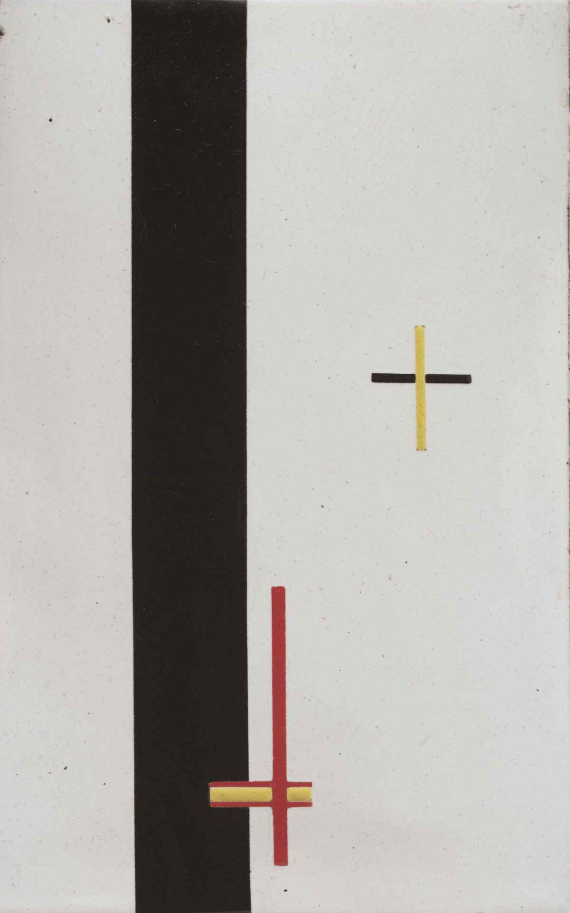

# Telematics & Network Art

This lecture borrows material from [Golan Levin](http://flong.com)

## Art Across Distances

**The impact of telecommunications technologies cannot be reduced to the practical and functional details of communication nor their economic impacts. They have meaning and implications far beyond the quick sending of messages and media to distant places. Psychologists and sociologists have discussed their impact on identity, privacy, interpersonal relationships, social movements, natonal boundiaries and more. Over the last four decades - especially since the advent of the World Wide Web - artists have explored the implications, possiblities and limits of these technologies. Artist and theorist [Roy Ascott](https://en.wikipedia.org/wiki/Roy_Ascott), who works with cybernetics and telematics - and is a pioneer in telecommunications-based art - believes that telecommunications technologies and the Internet are leading to an evolution of consciousness, while [Critical Art Ensemble](http://critical-art.net/) - a collective of [tactical media](https://en.wikipedia.org/wiki/Tactical_media) artists - believe this to be a kind of Western myopia borne of class-based privilege. We will look at both of these of artistic positions (and more) below.**

---

## Historical Telecommunication Machines

Smoke signals, reflected lights, homing pigeons are all early examples of human attempts to communicate across distances, what media theorist Marshall McLuhan would later refer to (in reference to telecommuications of the modern age) as "extending our central nervous systems".

*Semaphore towers, such as the [Chappe Telegraph](https://en.wikipedia.org/wiki/Chappe_telegraph) shown here, were "[optical telegraphs](https://en.wikipedia.org/wiki/Optical_telegraph)" a line of towers (usually 5 to 15 kilometers apart) used for sending coded messages and other textual information. These telegraphs were our first data networks*

*Telegraph Hill and Coit Tower, San Francisco*

*Hydraulic Telegraph, 4th century BC, Ancient Greece*

Today, we participate in synchronous video calls with Skype and FaceTime, collaboratively edit documents in Google Docs, and build multiperson virtual environments in MineCraft. These systems and processes are part of the fabric of everyday life, but it hasn't always been so, and it's worth stepping back and thinking about the use of networked telecommunications in media arts. As is often the case, some media artworks from the past presaged common tools today... and others represent intriguing dead-ends in the history of attempts to devise new modes of communication.

In the projects below, questions how each project resolves issues of:

* Critical consideration of the nature of networked communication
* One to many / many to one / many to many / one to one
* Operationalization of the participant (user-generated media)
* Asynchronous vs. synchronous communication
* Equal roles vs. complementary roles
* Inhabiting a shared virtual space
* Which senses are engaged
* Anonymity and intimacy

---

## Telematics & Telepresence

### Telephone Picture (László Moholy-Nagy, 1923)
The [first use of telecommunications as an artistic medium](https://en.wikipedia.org/wiki/Telematic_art) occurred in 1923 when the Hungarian constructivist artist László Moholy-Nagy made [Telephone Pictures](https://www.moma.org/collection/works/78747). These works questioned the idea of the isolated individual artist and the unique art object.

*"In April 1923, Moholy had Construction in Enamel 2 and 3 made at a local enamel factory. He would later claim to have ordered them by describing them over the telephone, exaggerating both his distance from the manufacturing process that produced them and the degree of technological mediation involved. In doing so Moholy presented the artist in the modern age as producer of ideas rather than things. While sharing the same abstract geometric composition, the works use a mathematical progression to change its scale, highlighting the conception of the image as transferable data."* (MoMA)

* Compare with Miranda July, [*Learning to Love you More*](http://www.learningtoloveyoumore.com/index.php). See #23, "[Recreate this Snapshot](http://www.learningtoloveyoumore.com/reports/23/23.php)"

### VideoPlace (~1972-1989)
Myron Krueger's landmark [VideoPlace](https://youtu.be/dmmxVA5xhuo) (~1972-1989) was a 2D artificial reality that enveloped its users, and responded to their movements and actions, without the use of encumbering goggles or gloves. One of the first interactive computer artworks, it allowed participants in different locations to share a common virtual space -- even, at different scales.

### Hole in Space (1980)
Hole in Space (1980) was a "communication sculpture" by Kit Galloway and Sherrie Rabinowitz, which used live two-way video to connect street-level audiences in Los Angeles and New York City.

*"On a November evening in 1980 the unsuspecting public walking past the Lincoln Center for the Performing Arts in New York City, and «The Broadway» department store located in the open air Shopping Center in Century City (Los Angeles), had a surprising counter with each other. Suddenly head-to-toe, life-sized, television images of the people on the opposite coast appeared. They could now see, hear, and speak with each other as if encountering each other on the same sidewalk. No signs, sponsor logos, or credits were posted--no explanation at all was offered. No self-view video monitors to distract from the phenomena of this life-size encounter. [...] «Hole-In-Space» suddenly severed the distance between both cities and created an outrageous pedestrian intersection. There was the evening of discovery, followed by the evening of intentional word-of-mouth rendezvous, followed by a mass migration of families and trans-continental loved ones, some of which had not seen each other for over twenty years."*

### Telematic Dreaming (1992-1993)
Paul Sermon's [*Telematic Dreaming*](https://www.hgb-leipzig.de/~sermon/dream/) (1992-1993) "is an installation that exists within the ISDN digital telephone network. Two separate interfaces are located in separate locations, these interfaces in themselves are dynamic installations that function as customized video-conferencing systems. A double bed is located within both locations, one in a blacked out space and the other in an illuminated space. The bed in the light location has a camera situated directly above it, sending a live video image of the bed, and a person ("A") lying on it, to a video projector located above the other bed in the blacked out location. The live video image is projected down on to the bed with another person ("B") on it. A second camera, next to the video projector, sends a live video image of the projection of person "A" with person "B" back to a series of monitors that surround the bed and person "A" in the illuminated location. The telepresent image functions like a mirror that reflects one person within another person's reflection." (Paul Sermon)

### R/Place (2017)
[*R/Place*](https://en.wikipedia.org/wiki/Place_(Reddit)) "was a collaborative project and social experiment hosted on the social networking site Reddit that began on April Fools' Day 2017. The experiment involved an online canvas of one million (1000x1000) pixel squares, located at a subreddit called /r/place, which registered users could edit by changing the color of a single pixel from a 16-colour palette. After each pixel was placed, a timer prevented the user from placing any pixels for a period of time varying from 5 to 20 minutes." (Wikipedia)

### The Trace (1995)
In [*The Trace*](http://www.lozano-hemmer.com/the_trace.php) (1995), an interactive installation by Rafael Lozano-Hemmer, a participant encounters the moving, ghostlike "presence" of another person, who is located in an identical but separate room. Their presence is conveyed by a glowing spot created by a pair of intersecting beams of light.

### Telegarden (1995)
[*TeleGarden*](https://goldberg.berkeley.edu/garden/Ars/) by Ken Goldberg & Joseph Santarromana, is an art installation that allows web users to view and interact with a remote garden filled with living plants. Members can plant, water, and monitor the progress of seedlings via the tender movements of an industrial robot arm. Arguably a "true" social network, The Telegarden is a space of social interaction and community, fostering dialogue and reflection on the nature of the commons and the environment (which we all have to share).

### inTouch (1998)
[*inTouch*](https://tangible.media.mit.edu/project/intouch/) (Scott Brave & Andy Dahley, 1998) -- an experiment in telepresent haptics, allowed two people to communicate through shared movements of a set of wooden rollers.

### Kiss Communicator (1999)
[*Kiss Communicator*](https://tangible.media.mit.edu/project/intouch/) (Heather Martin & Duncan Kerr) is a concept prototype that allows you to blow a kiss to your beloved when he/she/they are in another part of the world.

### inter_skin (1994-95)
[*inter_skin*](http://www.stenslie.net/), by [Stahl Stenslie] is part of the artist's line of research into the body's relationship to networks and networked culture. The __inter_skin project__ features special sensor/stimulator suits worn by participants that is capable of both transmitting and receiving different sensory stimuli, particularly touch. Participants can send and receive tactile messages from one another. For example, by touching ones own body, that same touch is transmit across the network to the other participant. The strength of the touch is determined by the duration of the touch. Stenslie notes that the nature of the piece highlights certain phenomena such as autoerotic stimulation and "the conception of a shared virtual body."

### Social Turkers (2013)
Lauren McCarthy's [*Social Turkers*](http://socialturkers.com/) (2013) asks: "What if we could receive real-time feedback on our social interactions? Would unbiased third party monitors be better suited to interpret situations and make decisions for the parties involved? How might augmenting our experience help us become more aware in our relationships, shift us out of normal patterns, and open us to unexpected possibilities? I am developing a system like this for myself using Amazon Mechanical Turk. During a series of dates with new people I meet on the internet, I will stream the interaction to the web using an iPhone app. Turk workers will be paid to watch the stream, interpret what is happening, and offer feedback as to what I should do or say next. This feedback will be communicated to me via text message." (McCarthy)

---

## net.art & Networked Performance

### 1:1 (1999-2001)
[Lisa Jevbratt](http://jevbratt.com/)'s/[C5](http://c5corp.com)'s [*1:1*](http://rosebud.arts.ucsb.edu/~jevbratt/1_to_1/index_ng.html) is a series of data mappings of every ip address on the Internet (or more specifically the world wide web). It consists of a database of every IP address and several interfaces through which to view the web site (if there is one) for each IP in the database.

This project is a very differnt experience of the Web to te one provide by corproate search engines, social media sites, etc. provided by search engines and portals. It turns out that most of teh web is acutall inacessible (behind firewalls, password protected, simply not having anythng available, etc) and/or undeveloped or not maintained. Jevbratt  states that the "[t]he interfaces/visualizations are not maps of the Web but are, in some sense, the Web. They are super-realistic and yet function in ways images could not function in any other environment or time. They are a new kind of image of the Web, and they are a new kind of image."

### Ping Body (1990-98)
[*Ping Body*](https://www.youtube.com/watch?v=wTYYJZG0f68), by  Cyprus-born Australian performance artist [Stelarc](https://en.wikipedia.org/wiki/Stelarc) is a performance that employs the "ping" network utility (which is used to measure the round trip time of messages across a network, and iis itself based on the sound generated by sonar equipment in submarines to measure distance to other objects and the ocean floor) to control his body movements. Thus his body is controlled by an external data system (the Internet basically). The data is generated by pinging randomly at some thirty Internet domains and measuring the spatial distances and the time the signal needs to travel. The data thus collected is used to trigger muscle stimulators attached to Stelarc's body.

### Toy War (1999)
eToy Corporation's [*Toy War*](https://etoy.com/projects/toywar/). That time an art collective/coproration eToy went to (cyber)war with a tech start-up and won (rather easily).

### Police State (2003)
Jonah Brucker-Cohen's [*Police State*](https://www.coin-operated.com/2010/05/03/policestate-2003/) is a [Carnivore](http://r-s-g.org/carnivore/) client (basically a packet sniffer) that attempts to reverse the surveillance role of law enforcement into a subservient one for the data being gathered. The client consists of a fleet of 20 radio controlled police vehicles that are all simultaneously controlled by data coming into the main client. The client looks for packet information relating to domestic US terrorism. Once found, the text is then assigned to an active police radio code, translated to its binary equivalent, and sent to the array of police cars as a movement sequence. In effect, the data being "snooped" by the authorities is the same data used to control the police vehicles. Thus the police become puppets of their own surveillance. This signifies a reversal of the control of information appropriated by police by using the same information to control them.

### Autonomy Cube (2014)
[*Autonomy Cube*](https://paglen.studio/2020/04/09/autonomy-cube/) by Trevor Paglen, is a sculpture designed to be housed in art museums, galleries, and civic spaces. But this sculpture is also a provate wi-fi hotspot, with all traffic being routed over the [Tor network](https://www.torproject.org/As Paglen describes it "[t]he sculpture is meant to be both 'seen' and 'used'... [a]nyone can join this network and use it to [privately] browse the Internet." The scultpture is also a Tor relay, thus making the sculpture, the institution that hosts/exhibits and the end users part of a privacy‐oriented, volunteer run internet infrastructure.

