# Representing Time

Based upon a lecture by [Golan Levin](http://flong.com)

[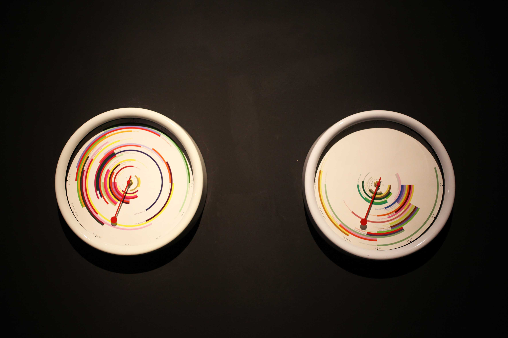](https://tegabrain.com/The-Phenology-Clock)
*[Phenology Clock](https://tegabrain.com/The-Phenology-Clock) (2014) - part of a project developed at the Environmental Health Clinic with Natalie Jeremijenko, Jake Richardson, Blacki Migliozzi, and others.*

## Deep History

*Question: Why does the circle have 360°?*

*Why is an hour 60 minutes?*

*Where do the days of the week get their names?*

*Why are there 7 days in a week?*

[A Brief History of the Calendar and Timekeeping](https://www.youtube.com/watch?v=OaYMK2n9Aow) (watch up to 12:42). Lecture by Dr. Donna Carroll, Lecturer of Physics, Maastricht University: 

[A History of Timekeeping in Six Minutes](https://www.youtube.com/watch?v=SsULOvIWSUo). Contextualizes timekeeping in relation to military history.
[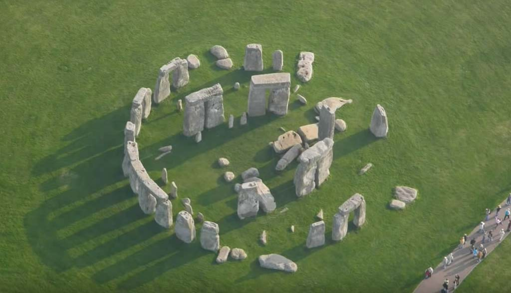](https://www.youtube.com/watch?v=SsULOvIWSUo)

[72 Micro-Seasons in Ancient Japan](https://thekidshouldseethis.com/post/japan-72-micro-seasons-change-mindfulness-video)

---

## Unusual Historical Clocks

(*These examples taken from: [A Minor History Of / Time without Clocks](http://www.cabinetmagazine.org/issues/29/foer.php) by Joshua Foer.*)
Joshua Foer has done such an excellent job, it is best just to link to his [*A Minor History of Time Without Clocks*](http://www.cabinetmagazine.org/issues/29/foer.php). Here’s a [PDF backup](http://cmuems.com/2016/60212/resources/foer_time_without_clocks.pdf). Let’s pay special attention to the following:

* 1600’s Cannon Alarm Clock. 
	* *"The cannon dial, also known as the noonday gun, is the first natural timekeeper with an alarm setting. It consists of a small cannon and a lens mounted on a horizontal dial. As the sun passes through high noon, its rays are concentrated through the precisely positioned magnifier, igniting a small amount of gunpowder and setting off the gun."*
   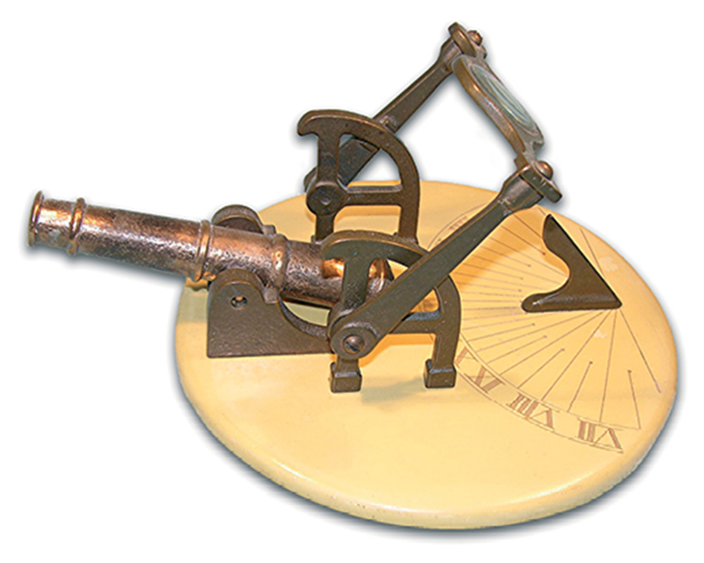
* 1728 Sawai Jai Singh’s 90-foot tall sundial, accurate to 2 seconds:
	* 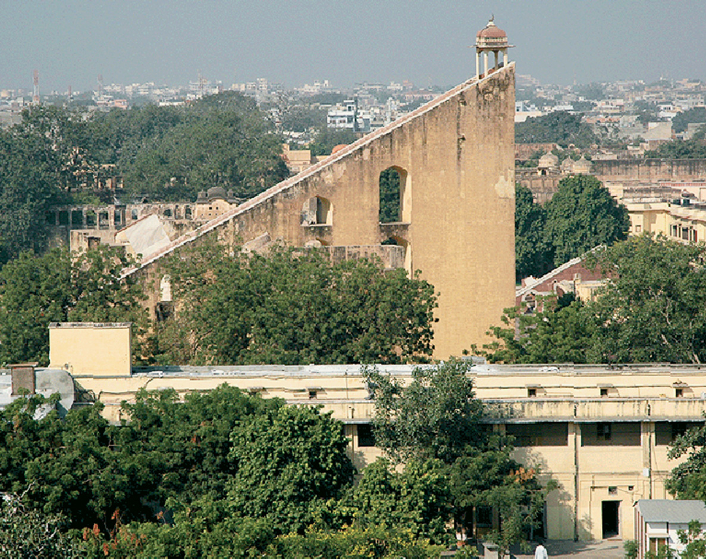
* 1733 Moon Dial at Cambridge University, read by the shadow of the moon:
	* *"In addition to the traditional solar hours, the timepiece has an accompanying table that can be used to read the shadow cast by the moon. Even with the table, however, a series of four mathematical calculations has to be carried out by anyone wishing to know the time."* 
	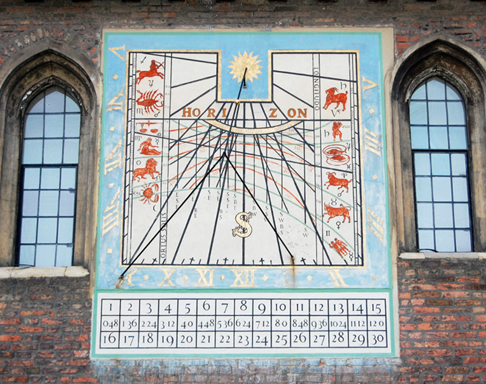
* 1751 Linnaeus’s flower clock, read from the opening of flowers. 
	* *"Linnaeus notes in his Philosophia Botanica that if one possessed a sufficiently large variety of aequinoctal species, it would be possible to tell time simply by observing the daily opening and closing of flowers."*
	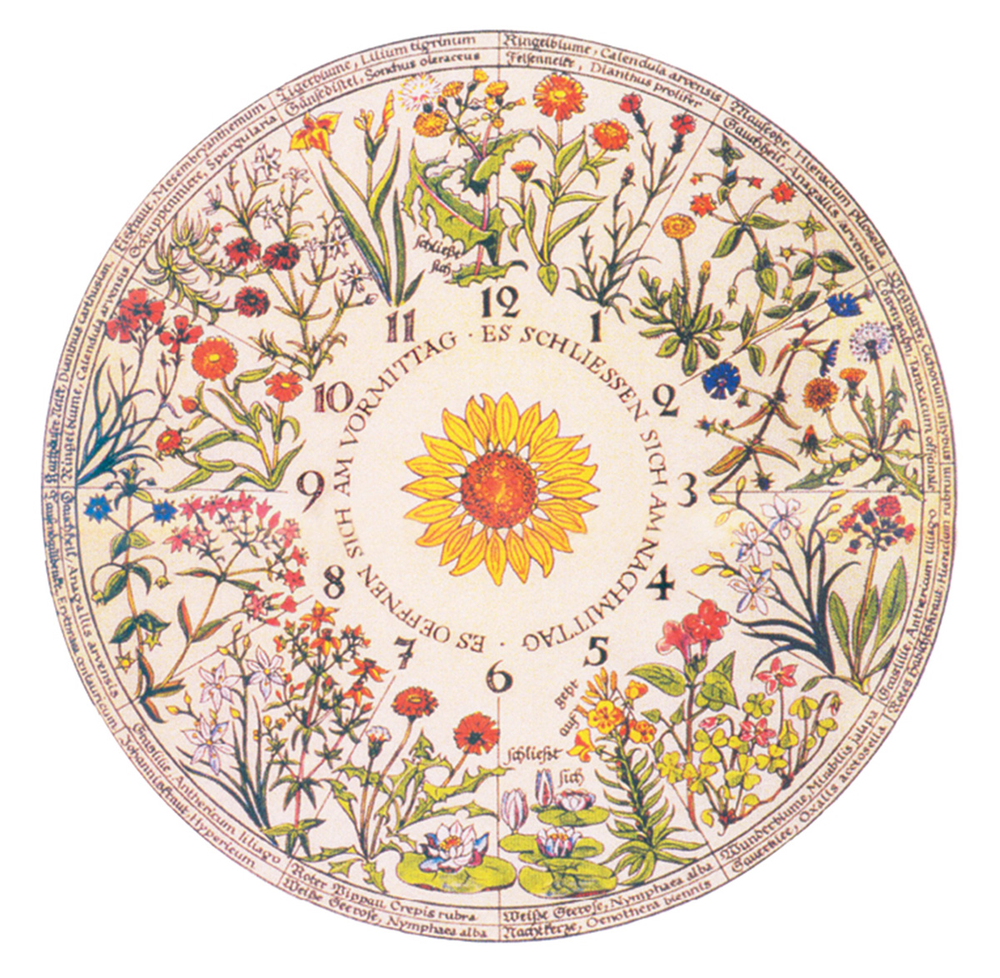
* 1929 Kleinhoonte's “aktograph”, or bean leaf movement clock:
	*  *"Dutch botanist Anthonia Kleinhoonte employs a measuring device known as the “aktograph” to precisely record the rhythms of a bean leaf’s movement throughout the day. A thin filament attached to the leaf is connected to a stylus, which draws on a revolving smoke drum. As the leaf rises in midday, so too does a line rise on the drum, only falling back as the leaf begins to slump in the evening. Her measurements demonstrate that the plant lives according to a strict daily rhythm".*
	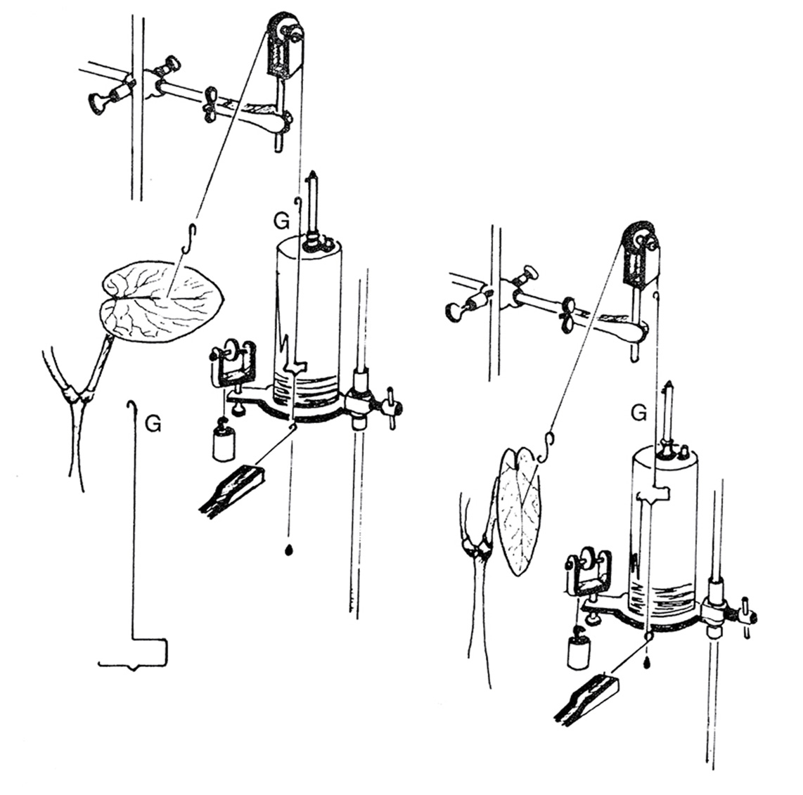

---

## 12 is Arbitrary!

It’s worth remembering that the convention that we use 12 (or 24) hour time is *totally arbitrary* — an artifact of ancient Egyptian astronomy. Other systems have been used and proposed. For example, until quite recently, a six-hour day was used in Thailand. During the French Revolution, when the metric system was invented, people seriously proposed decimal time. 

Here’s a decimal clock from the late 1700s: 
[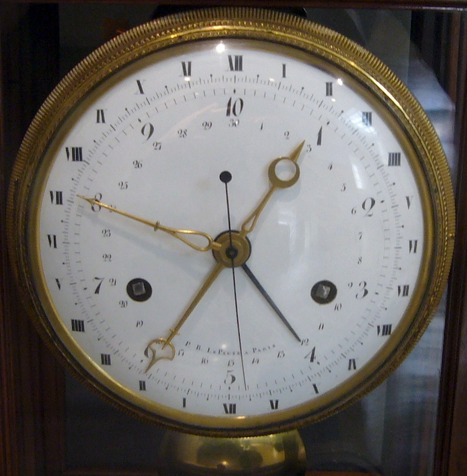]()

We see this again in the *10-Hour Flux Clock* by George Maciunas (1969): 

---

## Software Clocks

Let’s start with something simple. [The Colour Clock](http://thecolourclock.co.uk/) displays the current time as a hexadecimal color. Hours = red, minutes = green, seconds = blue. There you go; glad that’s over with. In case you were wondering, more than several people have thought of this idea. Low hanging fruit.

Now let’s go back in history. Here are John Maeda’s [12 O’Clocks](http://www.maedastudio.com/2004/rbooks2k/twelve.html) from 1996. If the real apps (OS9) don’t work any longer, [here’s a video](https://www.youtube.com/watch?v=nA_UTUvC4h8) (jump to 4’00”).

[Maeda's 12 O'Clocks](http://cmuems.com/2016/60212/lectures/lecture-09-09b-clocks/maedas-clocks/) 

#### *Live Mac OS9 demonstration instructions:*

* Download artwork from [http://www.maedastudio.com/2004/rbooks2k/twelve.html](http://www.maedastudio.com/2004/rbooks2k/twelve.html), [here (twelve.sit)](other/twelve.sit), or an unarchived version [here (12oclocks.app)](other/12oclocks.app)
* It may be necessary to install [Stuffit Expander](https://apps.apple.com/us/app/stuffit-expander-16/id919269455).
* Unstuff twelve.sit, and locate the unstuffed *12oclocks.app* in the directory /Users/Shared/MaedaClocks/12oclocks/
* Launch the [SheepShaver OS9 emulator](http://sheepshaver.cebix.net/), for which you can find downloads in this [forum](https://www.emaculation.com/forum/viewtopic.php?f=20&t=7360&sid=9f0939dd674fd526f11aa79efbb56c30) or [here (Version 2.5, 8/10/2020)](SheepShaver_notarized_20200810.zip). I'm using the instructions [here](https://emaculation.com/doku.php/sheepshaver_mac_os_x_setup) with the *New World PPC ROM*  and *Mac OS 9 Boot Image* from [here](https://www.redundantrobot.com/sheepshaver/)
* After OS9 launches, navigate to Unix/MaedaClocks/12oclocks in OS9; run demo
* You may need to force-quit SheepShaver to exit.

---

Clocks have been an idee fixe in new media. Here's the elegant video-slitscan-based [*Last Clock*](https://vimeo.com/27975734), (2002) by Jussi Angesleva & Ross Cooper: 
[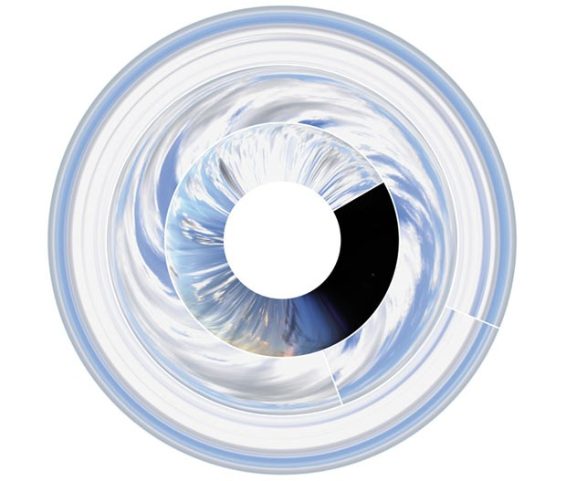](https://vimeo.com/27975734)

---

## The Clock and Human Industry

[*Real Time: Schiphol Clock*](https://vimeo.com/171408075) by Maarten Baas 
[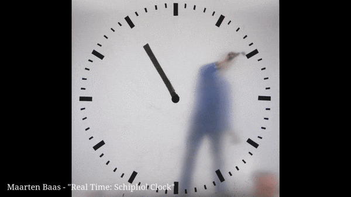](https://vimeo.com/171408075)
[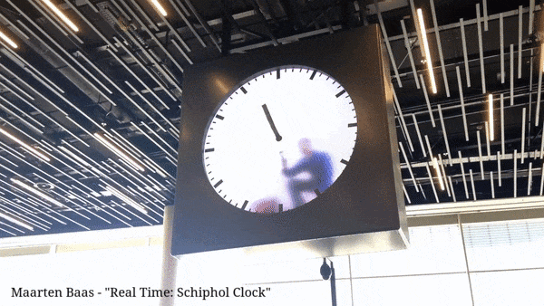](https://www.youtube.com/watch?v=EAax4BSKNQU&t=1m38s)

[*Standard Time*](https://www.youtube.com/watch?v=81Q3imVqBEk&t=0m12s) by Mark Formanek 
[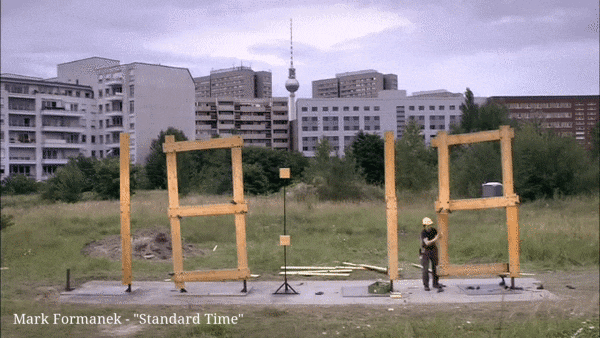](https://www.youtube.com/watch?v=81Q3imVqBEk&t=0m12s)

[*Industrious Clock*](https://www.youtube.com/watch?v=xkAfH11FJDk) by Yugo Nakamura 
[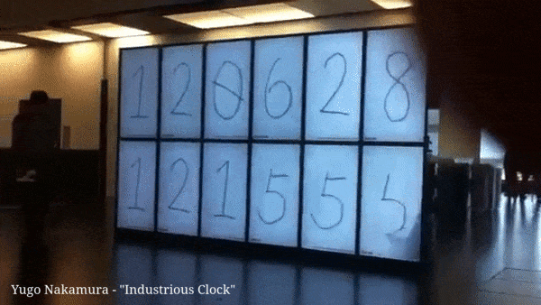](https://www.youtube.com/watch?v=xkAfH11FJDk)

## Crowdsourced Clocks

[*All the Minutes*](http://alltheminutes.com/) by Studio Moniker, is a clock which cites tweets that mention the current time. 
[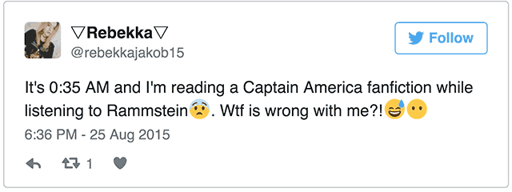](http://alltheminutes.com/)

The [Human Clock](http://www.humanclock.com/) is a clock made from crowdsourced photographs that feature the current time. 
[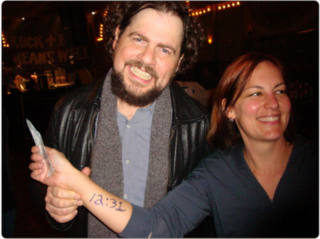](http://www.humanclock.com/)

A well-known ‘crowdsourced’ clock (in a different sense) is Christian Marclay’s [*Clock*](https://www.youtube.com/watch?v=BXbQw0rE5UE), a 24-hour film made up of about seven thousand clips, each of which either says or displays the (actual) time of day, or which makes a cogent reference to time:

[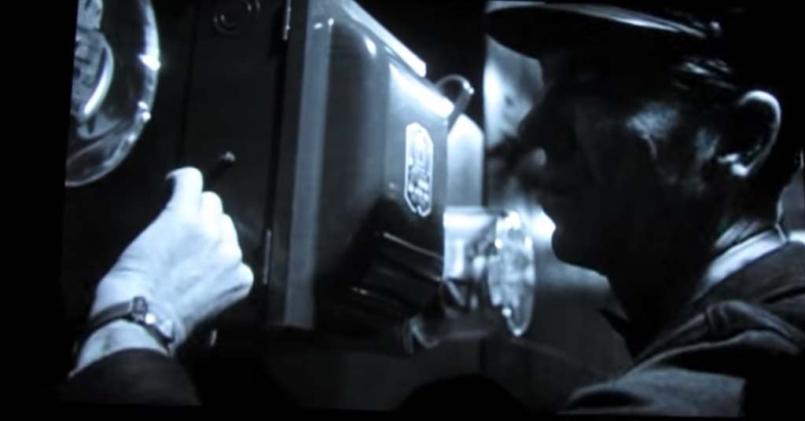](https://www.youtube.com/watch?v=BXbQw0rE5UE)

---

## Physical Machines & Clock Typography

[*Continue Time*](https://vimeo.com/10800426) by Sander Mulder 
[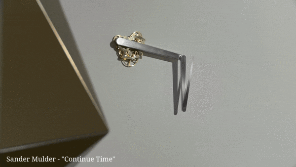](https://vimeo.com/10800426)

[*Ferrolic*](https://vimeo.com/116510462) by Zelf Koelman 
[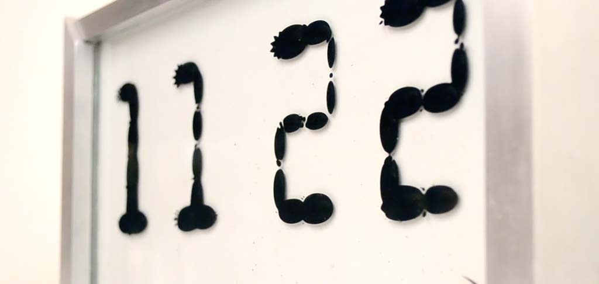](https://vimeo.com/116510462)

[*It's about time*](https://makezine.com/2007/09/27/clock-tells-time-as-a-con/) by insightoutsight /  Laurence Willmott 
[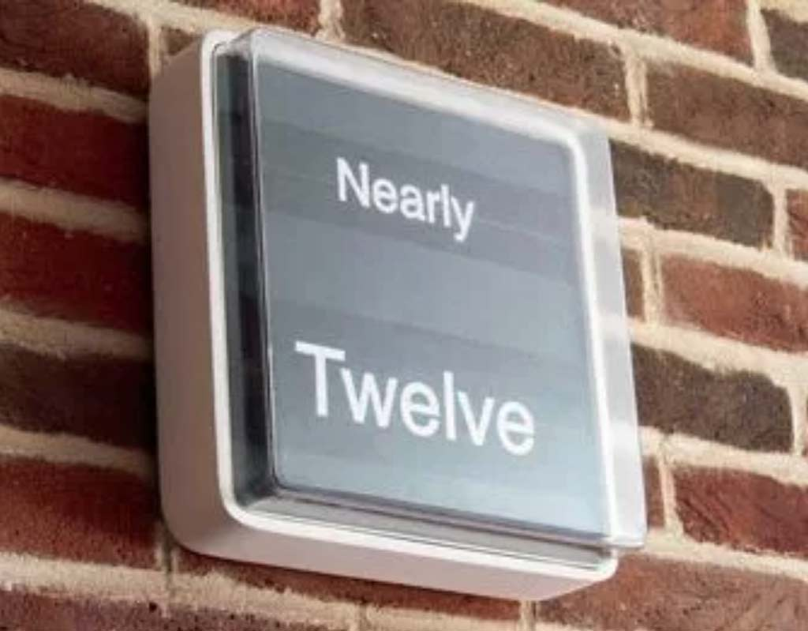](https://makezine.com/2007/09/27/clock-tells-time-as-a-con/)

---

## Monuments: Markers of Time

Though not clocks or otherwise keepers of time in the traditional sense, monuments are still markers of time in place. They function as windows to cultural values by pointing to the moments in history, people and places a culture chooses to remember and publicly mark. The location of the monument and relationship to surrounding spaces, the materials used, its history and reasons for its construction are all important elements that contribute to the power (or impotence) of the monument.

Monuments are not fixed in memory or meaning. Sometimes history is lost and forgotten and monuments lose their 'currency', or the settings of monuments may change, thereby shifting and changing their context and meaning.

Monumnents may also not be fixed physically in space and time.

_The (1979) by  Monument Against Fascism_ by Esther Shalev-Gerz and Jochen Gerz is a 12 metre-high column with a perimeter of 1 metre square and clad in lead that slowly burrows into the ground over time. Installed in a busy public square, residents were invited with a text, translated in seven languages, to ratify a public statement about fascism by engraving their names with the metal pencil provided directly onto the surface of the monument.

"We invite the citizens of Harburg, and visitors to the town, to add their names here to ours. In doing so we commit ourselves to remain vigilant. As more and more names cover this 12 metre-high lead column, it will gradually be lowered into the ground. One day it will have disappeared completely and the site of the Harburg monument against fascism will be empty. In the long run, it is only we ourselves who can stand up against injustice."

[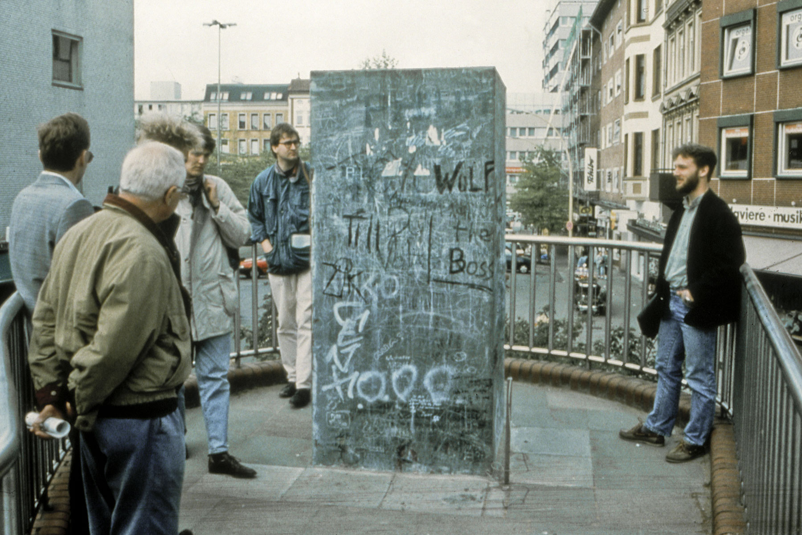](https://www.shalev-gerz.net/portfolio/monument-against-fascism)
[*The Monument Against Fascism*](https://www.shalev-gerz.net/portfolio/monument-against-fascism/) (1979) by Esther Shalev-Gerz and Jochen Gerz 

---

## New Graphics; New Concepts

[*Ink Calendar*](http://www.oscar-diaz.net/work/ink-calendar) by Oscar Diaz uses capillary action to display the time. 
[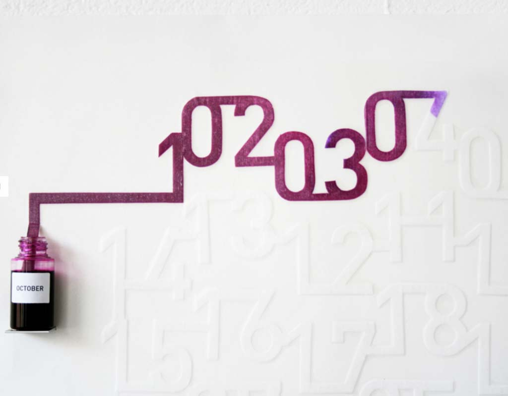](http://www.oscar-diaz.net/work/ink-calendar)

[*A Dot for Every Second in the Day*](http://www.clarifyscience.info/assets/day_of_dots_clock) 
[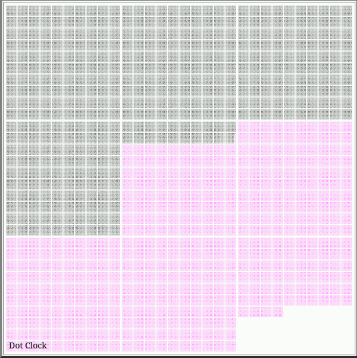](http://www.clarifyscience.info/assets/day_of_dots_clock)

[*Zero Noon*](http://lozano-hemmer.com/zero_noon.php) by Rafael Lozano-Hemmer 
[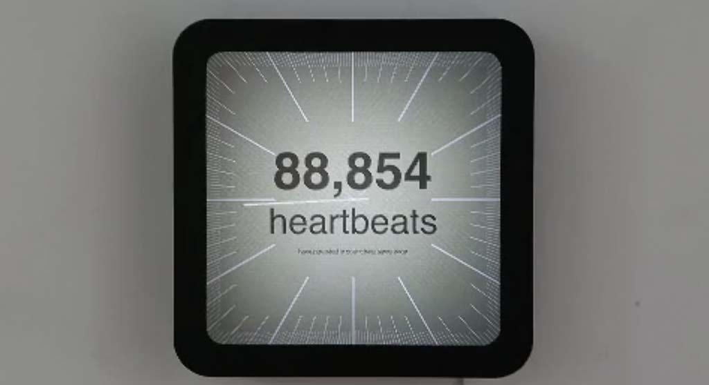](http://lozano-hemmer.com/zero_noon.php)

* [Untitled (Perfect Lovers)](https://collections.dma.org/artwork/5324909) - by Félix González-Torres. Two synchronized clocks embody the tension that comes from two people living side-by-side as life moves forward towards death.

In some situations, it may not be necessary for a clock to “work” mechanically in order for it to “operate” powerfully. Below are clocks which are frozen at 8:15am, the moment when the Hiroshima bomb detonated, when Kengo Nikawa’s pocketwatch stopped forever.
[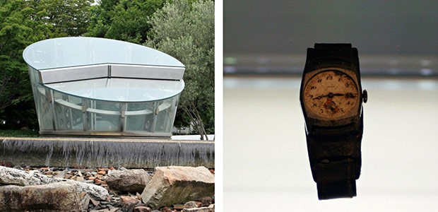]()

In another situation, a clock may simply be working so slowly that it never appears to be working in our lifetime. The *Clock of the Long Now*, designed to last 10,000 years, ticks once per year and chimes once per century. As such, it fosters long-term thinking and remains an important symbol of hope for the future.

[*The Clock of the Long Now*](https://www.youtube.com/watch?v=w9uM6BBKfO8) (10,000 Year Clock)
[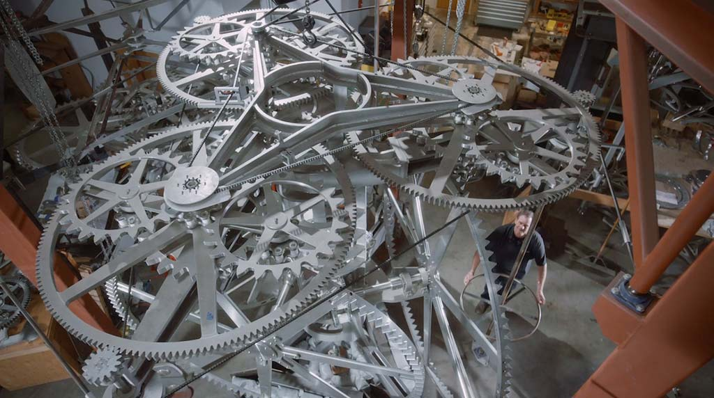](https://www.youtube.com/watch?v=w9uM6BBKfO8)
