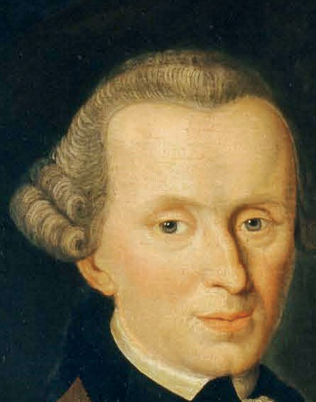
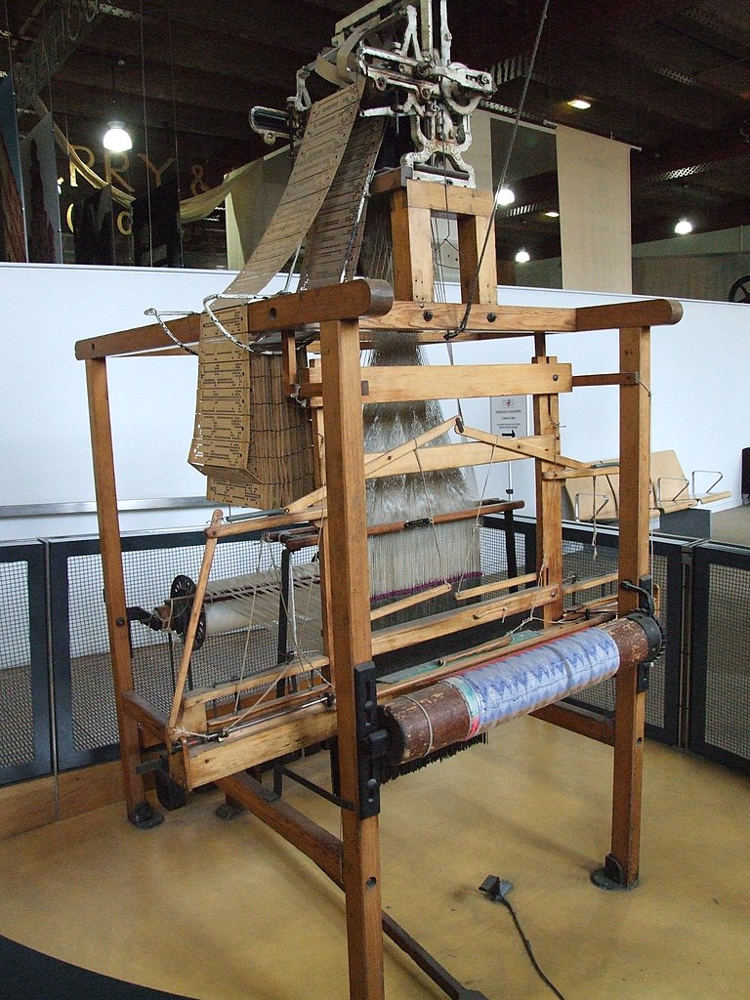
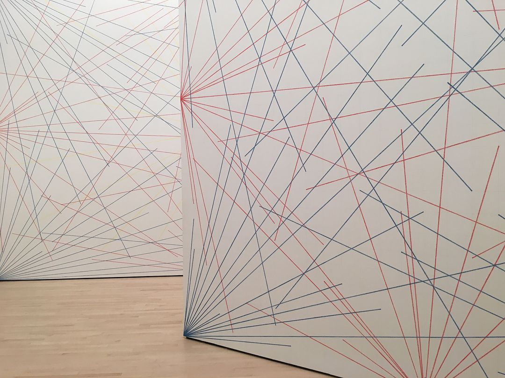
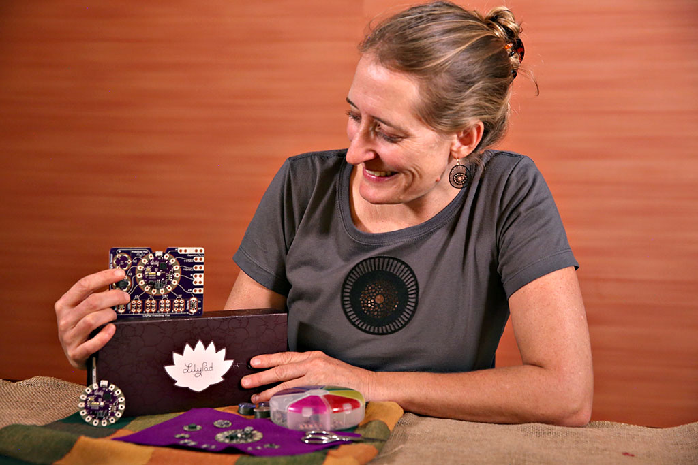

# Aesthetics & Computation: An Introduction

## Preliminaries

* Roll call
* Syllabus
* What do you think this class is about?
* What are your skills, interests?
* What have you seen in the area “creative coding”, computation aesthetics, “new media art”, etc
* What do you want to get out of this class?

## What is Aesthetics?

Aesthetics can be defined as normative judgements related to questions of beauty and the nature of taste, especially in the arts. It is considered a branch of philosophy concerned with these judgements

Philosopher Immanuel Kant argued that beauty is not a property of an artwork or natural phenomenon, but is instead best understood as the pleasure derived from how the given artwork or natural phenomenon stimulates our imagination. His theory of the [sublime](https://en.wikipedia.org/wiki/Sublime_(philosophy)) connects great art and beauty to subjective qualities of greatness and wonder that are beyond human possibility of measurement, imitation or otherwise full understanding (similar to God).

However much 20th century and contemporary art, especially art that uses technology or engages with the sciences, does not fit into this Kantian notion of beauty and aesthetics. Much of this art is strange, confusing, weird and not beautiful by conventional means. Herbert Grabes calls this the “[aesthetic of the strange](https://books.google.com/books?id=Afp5DwAAQBAJ&source=gbs_navlinks_s)”, which sits somewhere between the beautiful and the sublime. For Grabes, this broad spectrum and variety of strangeness provides a foundation for understanding the modern and postmodern arts. In causing a sense of alienation which spans a spectrum from mild irritation all the way to uncanniness, Grabes argues that these new kinds of experiences demand that readers and viewers be “especially creative in their attempts to understand the works” (11). This in turn may lead to a pleasurable expansion or alteration of ingrained modes of perception and consciousness, thus “test[ing] the limits of conceptual thought” (15).

So for this course, you will be asked to consider different kinds of aesthetics from what you may have been taught or otherwise been aware of. Consider that in the age of AI, biotech, big data, etc there will be an aesthetics of these things that will not conform to conventional or preexisting models.

## Art with Computers?

The relationship between computation and images is actually much older than perhaps even some computer scientists know. The Jacquard loom from the early 19th century (there were even earlier versions) greatly simplified the process of manufacturing textiles with complex visual patterns such as damask, brocade and jacquard. Interchangeable punch cards were used as a kind of code for the weaving of the patterns.

[Video of Jacquard Loom in action](https://www.youtube.com/watch?v=MQzpLLhN0fY)

However the earliest iterations of computer art and generative art was the work of artists such as [Frieder Nake](https://en.wikipedia.org/wiki/Frieder_Nake), [Vera Molnar](https://en.wikipedia.org/wiki/Vera_Moln%C3%A1r) and [John Whitney](https://en.wikipedia.org/wiki/John_Whitney_(animator)), among others.

[John Whitney's 'Catalog' (1961)](https://youtu.be/TbV7loKp69s)

Today, computers are used for _everything_. Photoshop and related tools have been around for more than a quarter century. In this course, we will distinguish between art that happens to have been made on a computer, and art which necessarily requires the development of new technology (software, circuits).

## A Bit of Historical Context

The conceptual and aesthetic roots of New Media/Computational art actually extend further back to the emergence of the Dada movement in early 20th century Europe. Dada emphasized non-sense, non-rationality, critique of existing structures. It critiqued the hubris of Western bourgeois society. Dadaist strategies included:

* collage
* [readymades](https://en.wikipedia.org/wiki/Readymades_of_Marcel_Duchamp)
* political action/tactical media
* irony and absurdity

*'Fountain', Marcel Duchamp (1917-).*

Other related movements which we will touch on this semester include:

* [Surrealism](https://en.wikipedia.org/wiki/Surrealism)
* [Conceptual Art](https://en.wikipedia.org/wiki/Conceptual_art)
* [Minimalism](https://en.wikipedia.org/wiki/Minimalism)
* [Fluxus](https://en.wikipedia.org/wiki/Fluxus)
* [Systems Art](https://en.wikipedia.org/wiki/Systems_art)
* [Situationists](https://en.wikipedia.org/wiki/Situationist_International)

*Sol Lewitt's 'Wall Drawings' (1969-).*

## Art & Aesthetics in a School of Computer Science

* How many of you have taken an art or music course?
* How many computer science courses outside of IGM have you taken?
* As curious and creative people, are your IGM coding courses different from regular CS courses? If so, how?
* How many of you like art or music but came to IGM because it will help you get a “real job” while still having some connection to art, entertainment, media.

Designer/educator/engineer, [Leah Buechley](https://leahbuechley.com/), has observed that STEM subjects generally fail to educate students who:

* learn concretely (from examples) rather than abstractly (from equations)
* work improvisationally rather than by planning everything in advance
* are interested in creating expressive objects or systems, rather than utilitarian solutions.

Of traditional computer science introductions, educator-innovator [Mitchel Resnick](https://www.media.mit.edu/~mres/) has remarked, "It's like offering a writing class that teaches only grammar and punctuation without providing students a chance to write their own stories."

This class will attempt to address that.

It's possible that STEM education might benefit from the inclusion of arts-oriented pedagogical approaches. But that’s not the problem that concerns us here. Instead, in a world in which computing now touches every discipline, it should no longer be taken for granted that computing must be taught by computer scientists (it’s like if only nutritionists were allowed to cook your food). Computer Science is a discipline, but programming is a skill (or a tool, or a medium, or better yet, a craft) which has different communities of use with different pedagogical needs.

"Creative coding" describes the growing set of cultural practices by which artists, designers, architects, and poets employ computer programming and custom software as their chosen medium. This burgeoning field has been accelerated by the widespread adoption of open-source arts-engineering toolkits, such as [Processing](https://processing.org/), [p5.js](https://p5js.org/), and [openFrameworks](https://openframeworks.cc/), into the curricula of hundreds of art and design schools around the world. Created by artists, for artists, these toolkits are specifically oriented to the needs and working styles of cultural practitioners, and have radically democratized software development as a potent mode of creative inquiry.

You, as IGM students, may be in a Computing Science college, but make no mistake — you are making cultural artifacts. Thus our objective here is to make compelling provocative new forms of culture, and our medium is software and electronics. We learn codeing as necessary to execute our ideas.

We can learn via hands-on tinkering and experimentation. While success (however you define it) won’t happen overnight, know that with a modest set of skills as simple as (1) identifying what you don’t know, (2) knowing how and where to look things up and (3) how to inquire, research question, etc and (4) how to tinker and and keep tinkering, you will eventually reach your goals.