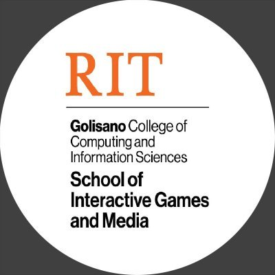

# IGME670
**RIT IGM Digital Audio Production**

## _Fall 2024_ syllabus for Digital Audio Production & Sound Design course (IGME670) at the School of Interactive Games & Media ##

# Course Information

_This document exclusively covers the policies and procedures for IGME-670. This document does not include information about topic units, specific assignments, or readings. These can be found in the Content section on myCourses._

<table>
  <tr>
   <td>

Title

   </td>
   <td>Digital Audio Production &amp; Sound Design (IGME-670), Fall 2024
   </td>
  </tr>
  <tr>
   <td>

Meeting Times

   </td>
   <td>Tue/Thur, 5 - 6:15pm
   </td>
  </tr>
  <tr>
   <td>

Location

   </td>
   <td>MSS-3110 (MAGIC CENTER)
   </td>
  </tr>
  <tr>
   <td>

Credits

   </td>
   <td>3 credits
   </td>
  </tr>
  <tr>
   <td>

Instructor

   </td>
   <td>Carlos Castellanos
   </td>
  </tr>
    <tr>
   <td>

Instructor contact

   </td>
   <td><a href="https://www.rit.edu/computing/directory/cxcigm-carlos-castellanos">see this page</a> (also on myCourses)
   </td>
  </tr>
</table>

---

Digital audio production (recording, mixing and mastering)

sound synthesis

audio signal processing (including filtering, delay, and reverb)

sound art and sound design

data flow, timing and interaction

MIDI & OSC

Integration of sonic and visual elements

Web audio

Sound for film and games

Reaper
WWise and/or FMOD
Max/MSP
