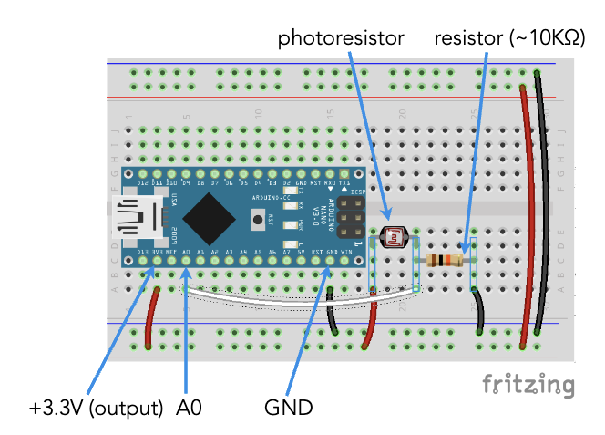
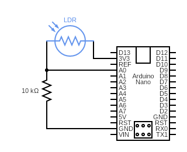

# IGME 480

# Physical Computing & Alternative Interfaces

### Spring 2026

# Workshop

## Simple Light-Based Interface

We will build a simple interface using Processing, Arduino and a single photocell. This will be a “Lantern Field”. Floating lanterns react to light, riseing and glowing in response. Darkness makes them drift down and dim.

- Brightness level controls overall glow and vertical motion.
- Rising light (e.g. shine a flashlight over the photocell) makes lanterns surge upward and pulse.
- Falling light (cover the sensor) makes them sink and cool down.
- Sudden changes in light create ripples
- Subtle noise keeps things organic.

## Learning Objectives
- What “analog” really means with regard to sensors
- How to read and smooth sensor data in Arduino
- How to detect changes (rising vs falling values)
- How sensor behavior can drive expressive visuals in Processing
- How to think in terms of interaction and behavior, not just input/output or numbers

---

>[!NOTE]
> **Workshop Prerequsites**
- Basic familiarity with Arduino and Processing
- Arduino IDE
- Processing IDE
- Arduino microcontroller
- Breadboard
- Photocell (LDR)
- 10k resistor
- hook-up wire
- USB cable

---

## Step 1: Introduction
- Analog sensors output a range, not a state.
- Most interesting interactions come from change over time, not absolute values.
- Today’s goal: translate light behavior into motion and mood.

## Step 2: Hardware Setup
Wire a photocell to Analog Input 0 (A0) on your Arduino microcontroller. Refer to the Week 3 slides, the images below or [this web page](https://physicalcomputing.ccastellanos.com/labs/arduino/arduino-analog-input/) if you need a refresher on how to do this.

  

## Step 3: Reading Analog Values from a Photocell

Upload this Arduino code to your microcontroller and open the Serial Monitor.

```
// read values at A0 and smooth them with a smoothing (low-pass) filter
const int sensorPin = A0;

int rawValue = 0;
int smoothValue = 0;
int lastSmoothValue = 0;

float weight = 0.1; // smoothing factor (0.0 - 1.0)

void setup() {
  Serial.begin(9600);
}

void loop() {
  rawValue = analogRead(sensorPin);

  // smoothing the sensor values with a weighted average (low-pass) filter
  smoothValue = weight * rawValue + (1 - weight) * lastSmoothValue;

  // value holds rising or falling info
  int delta = smoothValue - lastSmoothValue;

  // send data over the serial port
  Serial.print(smoothValue);
  Serial.print(",");
  Serial.println(delta);

  lastSmoothValue = smoothValue; // update the variale holding the previous sensor value
  delay(2); // slight delay to not overoad the serial port
}
```

## Step 4: Sensor Analysis: Detecting Rising & Falling Values

Observe the Serial Monitor (click magnifying class icon in upper right), specifically the `delta` value:
- Positive delta → light increasing
- Negative delta → light decreasing

Try this:
- Cover the sensor slowly
- Shine a phone flashlight quickly
- Observe how the delta reacts

We can see not just where the sensor is but where it's going.

## Step 5: Serial Communication to Processing

Our data protocol: `lightValue,delta`. The "," serves as our delimiter so we know which value corresponds to wbich data element

## Step 6: Visualization: Lantern Field

Open Processing and run the follwoing code (note: make sure you quit the Arduino IDE or at least close the Serial Monitor)

```
import processing.serial.*;

Serial myPort;

int lightValue = 0;
int delta = 0;
static final float pulseRate = 0.05;

Lantern[] lanterns;
int numLanterns = 80;

void setup() {
  size(800, 600);
  smooth();

  myPort = new Serial(this, Serial.list()[0], 9600);
  myPort.bufferUntil('\n');

  lanterns = new Lantern[numLanterns];
  for (int i = 0; i < lanterns.length; i++) {
    lanterns[i] = new Lantern(random(width), random(height));
  }
}

void draw() {
  background(10, 15, 30);

  float glow = map(lightValue, 0, 1023, 50, 255);
  float lift = map(lightValue, 0, 1023, 0.2, 2.5);

  for (Lantern l : lanterns) {
    l.update(lift, delta);
    l.display(glow);
  }
}

void serialEvent(Serial myPort) {
  String data = trim(myPort.readStringUntil('\n'));
  if (data != null) {
    String[] parts = split(data, ',');
    if (parts.length == 2) {
      lightValue = int(parts[0]);
      delta = int(parts[1]);
    }
  }
}

class Lantern {
  float x, y;
  float speed;
  float size;
  float pulse;

  Lantern(float x, float y) {
    this.x = x;
    this.y = y;
    speed = random(0.3, 1.2);
    size = random(8, 18);
    pulse = random(TWO_PI);
  }

  void update(float lift, int delta) {
    if (delta > 0) {
      y -= speed * lift * 1.5;
    } else {
      y -= speed * lift * 0.5;
    }

    if (y < -20) {
      y = height + 20;
      x = random(width);
    }

    pulse += pulseRate;
  }

  void display(float glow) {
    float flicker = sin(pulse) * 10;
    noStroke();
    fill(glow, glow * 0.8, glow * 0.4, 180);
    ellipse(x, y, size + flicker, size + flicker);
  }
}
```

Observe and interact with your lanterns. You can try:

1. Slow vs Fast Light
  - What changes more: glow or motion?

2. Hand Shadows
  - Can you “breathe” with the system?

3. Sharp Spikes
  - What does a sudden or erratic delta feel like visually?

4. Different Data Mappings
  - How does the behavior of the lanterns change if you alter the data mappings (i.e. ranges for `glow` or `lift`)


## Step 7: Discussion

- What kind of behaviors feel expressive?
- Is absolute brightness or change more important?
- How would this differ with a potentiometer? A force sensor? Breath? Humidity?

Try to think less in terms of sensors as simply measureing the environment and more in terms of interpretation through constraints.

## Step 8: Experimentation and Extension

Experiment with ways to extend or alter this app. Challenge yourself to push this further. Here are some ideas:

- Add color shifts based on rising vs falling light.
- Spawn new lanterns on sharp light spikes.
- Gradually fade the lanterns away if there is no interactivity.
- Replace the photocell with another analog sensor
- Use a second sensor to control wind direction.
- Record sensor data and replay it like a visual memory.

## Step 9: Wrap-Up and Q&A

- Technical questions
- Design questions
- More resources available on myCourses

